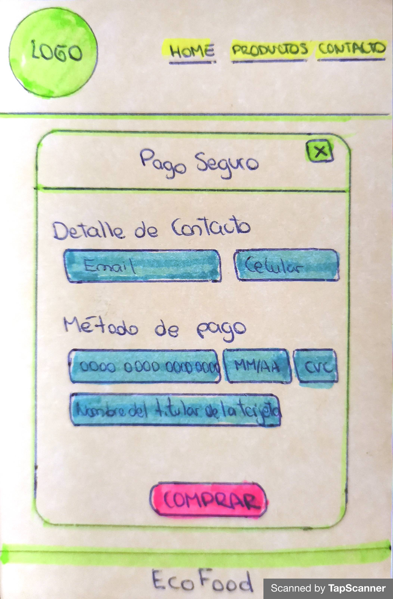
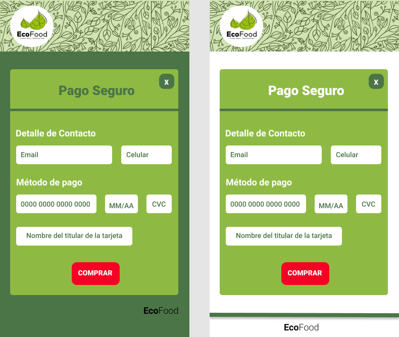
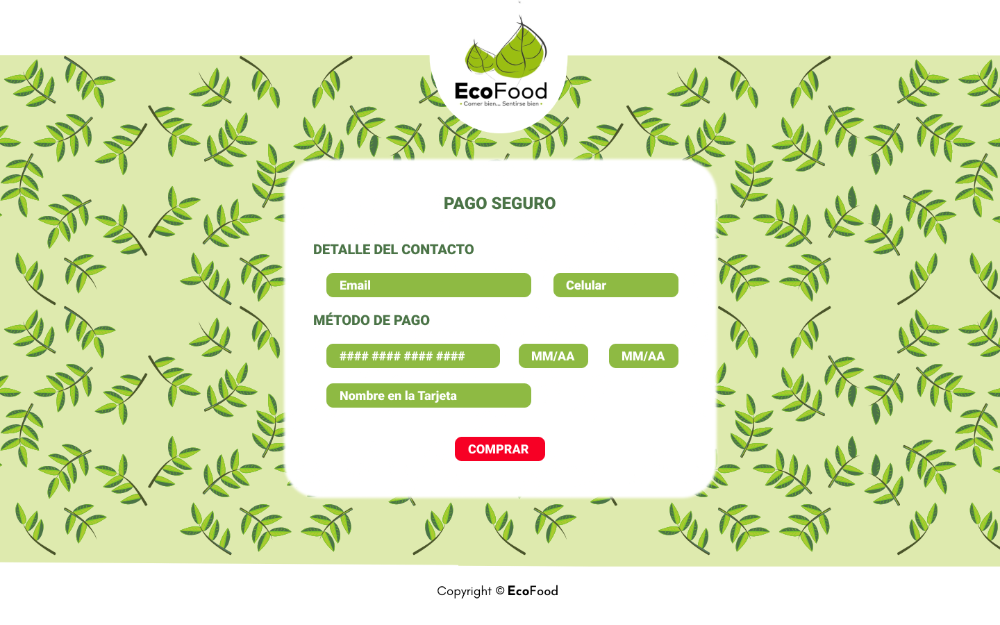
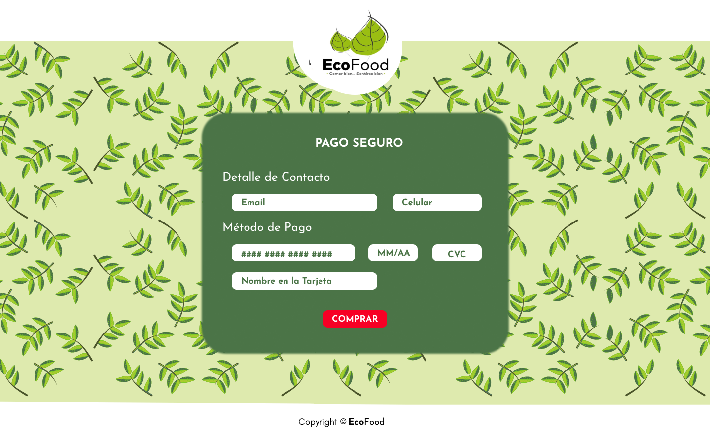

# EcoFood - VALIDACIÓN DE TARJETA

* [1. Resumen del proyecto](#1-resumen-del-proyecto)
* [2. Proyecto final](#2-proyecto-final)
* [3. UX](#3-ux)
* [4. Prototipo en papel](#4-prototipo-en-papel)
* [5. Prototipo en Figma](#5-prototipo-en-Figma)
* [6. Resumen de Feedback](#6-resumen-de-feedback)
* [7. Prototipo final](#7-prototipo-final)

## Resumen del proyecto

EccoFood en una empresa que ofrece productos organicos de calidad con sabor natural incomparable.
El presente proyecto permitira al usuario validar su tarjeta antes de realizar una compra de sus diferente productos.

## Proyecto final

## UX

   El presente proyecto permitira a los usuarios validar su tarjeta antes de realizar una compra de manera practica y sencilla. Para luego pueda disfrutar de los productos que ofrece EccoFood de manera rápida y segura.

## Prototipo en papel

   

## Prototipo en Figma

### Primer prototipo

### Segundo prototipo

## Resumen de Feedback

   Recibí Feedback de los couch Fares y Genesis y tambien de mis compañeras, lo cual me ayudo bastante al iniciar mi proyecto ya que tome mucho tiempo en prototipo, diseño, colores, fuentes, entres otros...
   Genesis me enseño a priorizar mis tareas y centrarme el mis objetivos de aprendizaje <3.

### Prototipo final

***